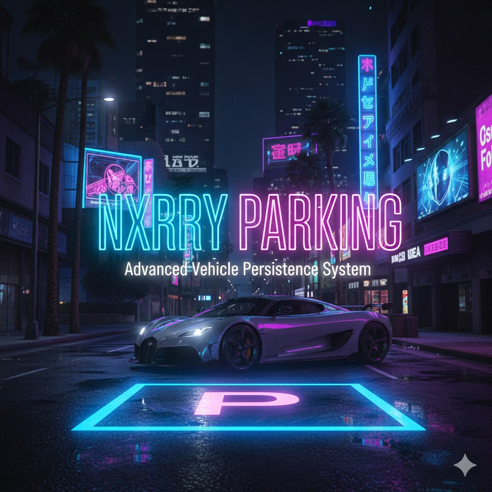

# 🚗 NXRRY Parking System (QBCore)


A high-performance **Street Parking System** for FiveM designed for realism, security, and long-term scalability.

This system saves the complete vehicle state to the database, ensuring vehicles remain at their parked location even after players disconnect from the server.

---

## 📺 System Showcase

<div align="center">

[](https://streamable.com/cx1j9w)

🎬 Click the image above to watch the full Video Demonstration.

</div>

---

# 🌟 Core Features

### 🅿️ Advanced Vehicle Persistence
- Real-time saving of:
  - Coordinates (X, Y, Z)
  - Full Rotation (X, Y, Z)
  - Engine Health
  - Body Health
  - Fuel Level
- Database-backed storage using `player_vehicles`

### 🔐 Security System
- Automatic door locking when parked
- Vehicle freeze position
- Invincibility state while parked
- Server-side ownership verification
- Distance validation to prevent remote exploits

### 🎡 Smart Radial Integration (F1)
- Fully integrated with `qb-radialmenu`
- Context-based options:
  - **Inside Vehicle → Park Vehicle**
  - **On Foot → View Parked Vehicles**
- Removed dependency on F6 command menus

### 👁 qb-target Interaction
- Remove vehicles from parking using Eye Target
- Immersive world interaction
- No command spam
- Cleaner roleplay flow

### 📋 Vehicle Status & Fine Viewer
- Inspect parked vehicle condition
- View engine/body/fuel status
- Check outstanding fines
- Preview ticket amounts

(Enforcement expansion planned)

### 📍 GPS Waypoint Support
- Locate parked vehicles easily
- Automatic waypoint creation

---

# 🚀 Major Update – v0.2.0 Full System Rework

> Complete Architecture Rewrite

This version introduces a full internal rebuild of the parking system.

⚠️ If you prefer the legacy behavior, you may continue using **Version 0.1.2**.

---

## 🔄 Menu Migration (F6 ➜ F1)

- Removed `/openparkingmenu`
- Integrated directly into `qb-radialmenu`
- Dynamic contextual interaction system
- Improved RP immersion

---

## 🅿️ Rebuilt Parking Core

### Improvements:
- Better coordinate precision
- Full rotation saving
- Improved SQL handling
- Cleaner metadata structure
- Enhanced entity existence verification
- Stronger anti-duplication logic
- Stable network entity synchronization
- Improved server callback validation

---

## 🚘 New Spawn Philosophy

Players are no longer required to manually spawn vehicles after parking.

The system now automatically handles:

- Vehicle state management
- Ownership verification
- Entity recreation validation
- Spawn integrity control

This creates a smoother and more realistic street parking experience.

---

## 💸 Secure Unparking & Depot Logic

- Mandatory payment if `depotprice` exists
- Automatic deduction from Cash or Bank
- Server-side financial validation
- Anti-exploit transaction handling

---

## 🔐 Backend Security Improvements

- Strict citizenid & plate validation
- Dual-layer distance check
- Entity network sync wait logic
- Duplicate spawn prevention
- Parking state locking improvements
- Secure SQL execution structure

---

## 🧠 Future Expansion Ready

The new architecture prepares the system for:

- 🚔 Police Parking Fine Commands
- 🚧 Impound System Integration
- 🔄 Vehicle Recovery System (Coming Soon)
- 📍 Zone-Based Parking Restrictions
- 🔑 Persistent Lock State Saving
- 💰 Advanced Fine & Billing Module

---

# ⚠️ Coming Soon – Vehicle Recovery System

We are developing a fallback recovery system for rare cases where vehicles may disappear due to unexpected issues.

Planned features:
- Vehicle integrity validation
- Automatic detection system
- Admin recovery command
- Safe respawn fallback logic

---

# 🛠 Commands

| Command | Function |
|----------|----------|
| *(Removed)* `/openparkingmenu` | Migrated to F1 Radial Menu |

---

# 📂 Resource Structure

- `config.lua` – Notification & Debug Configuration
- `fxmanifest.lua` – Resource Definition
- `client/main.lua` – UI Logic, Interaction & Spawning
- `server/main.lua` – Database Handling & Validation

---

# 🛠 Installation Guide

## 2️⃣ SQL Setup

Execute in your database:

```sql
ALTER TABLE `player_vehicles` 
ADD COLUMN IF NOT EXISTS `coords` TEXT DEFAULT NULL,
ADD COLUMN IF NOT EXISTS `rotation` TEXT DEFAULT NULL,
ADD COLUMN IF NOT EXISTS `parking` LONGTEXT DEFAULT NULL;
```

---

# 📜 Changelog History

---

## [v0.2.0] – Full System Rework
- Complete architecture rebuild
- F6 menu removal
- F1 Radial integration
- qb-target interaction
- Improved spawn logic
- Fine viewing system
- Backend security overhaul
- Performance optimization
- Smart Radial Menu introduction
- Vehicle diagnostic menu
- Secure depot payment logic

---

## [v0.1.1]
- Security hardening
- Network ID synchronization fix
- Anti-duplication improvements
- Alpha fade spawn transition

---

## [v0.1.0]
- Initial release
- Basic parking persistence system
- Coordinate & rotation saving
- Engine/Body/Fuel metadata tracking

---

# 📌 Developer Notes

Version 0.2.0 is a foundational rebuild designed for:

- Long-term scalability
- Advanced RP server environments
- Modular expansion
- Enterprise-level server stability

This is not just an update — it is a structural upgrade.

---

# ❤️ Built for QBCore Roleplay Servers

Designed for realism.  
Optimized for performance.  
Engineered for expansion.
